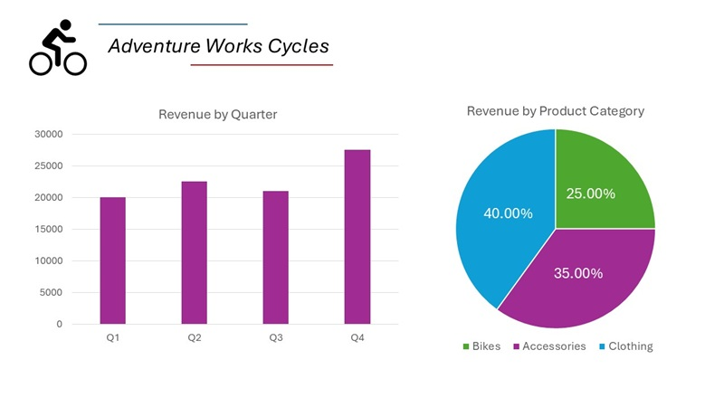
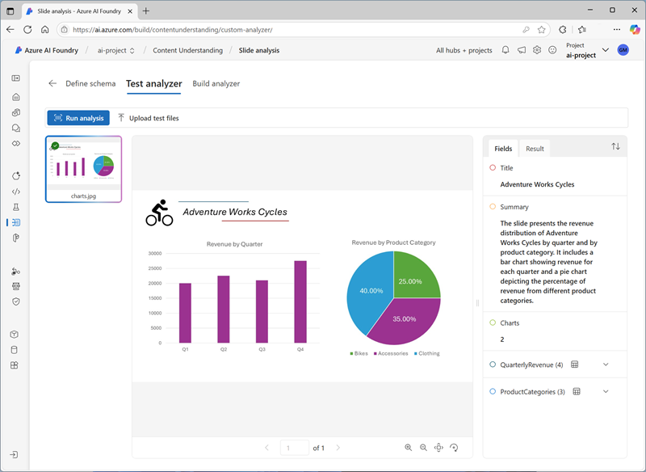

---
lab:
  title: 从多模式内容中提取信息
  description: 使用 Azure AI 内容理解从文档、图像、音频录制和视频中提取见解。
---

# 从多模式内容中提取信息

在本练习中，你将使用 Azure 内容理解从各种内容类型中提取信息；包括发票、包含图表的幻灯片图像、语音消息的音频录制和电话会议的视频录制。

此练习大约需要 **40** 分钟。

## Azure AI Foundry 中心和项目

我们将在本练习中使用的 Azure AI Foundry 功能，需要基于 Azure AI Foundry *中心*资源的项目。

1. 在 Web 浏览器中打开 [Azure AI Foundry 门户](https://ai.azure.com)，网址为：`https://ai.azure.com`，然后使用 Azure 凭据登录。 关闭首次登录时打开的任何使用技巧或快速入门窗格，如有必要，使用左上角的 **Azure AI Foundry** 徽标导航到主页，类似下图所示（若已打开**帮助**面板，请关闭）：

    

1. 在浏览器中，浏览到 `https://ai.azure.com/managementCenter/allResources`，并选择“新建”****。 然后选择创建新的 **AI 中心资源**的选项。
1. 在**创建项目**向导中，输入有效的项目名称，并选择创建新中心。 然后，使用**重命名中心**链接为你的新中心指定一个有效名称，展开“**高级选项**”，并为项目配置以下设置：
    - **订阅**：Azure 订阅
    - **资源组**：*创建或选择资源组*
    - 区域****： 选择以下位置之一（在撰写本文时，Azure AI 内容理解仅在这些区域中可用）：**
        - 澳大利亚东部
        - 瑞典中部
        - 美国西部

    > **注意**：如果你使用的 Azure 订阅启用了用于限制资源名称的策略，可能需要点击“**创建新项目**”对话框底部的链接，转到 Azure 门户以创建该中心。

    > **提示**：如果“**创建**”按钮仍然禁用，请确认你已将中心名称更改为一个唯一的字母和数字组合。

1. 等待创建项目。

## 下载  内容

要分析的内容位于 .zip 存档中。 下载它并将其解压缩到本地文件夹中。

1. 在新的浏览器选项卡中，从 `https://github.com/microsoftlearning/mslearn-ai-information-extraction/raw/main/Labfiles/content/content.zip` 下载 [content.zip](https://github.com/microsoftlearning/mslearn-ai-information-extraction/raw/main/Labfiles/content/content.zip)，并将其保存到本地文件夹中。
1. 解压缩下载的 content.zip 文件并查看它包含的文件。** 在本练习中，你将使用这些文件来生成各种内容理解分析器。

> **注意**：如果只对探索特定形式（文档、图像、视频或音频）的分析感兴趣，可以跳至下面的相关任务。 为了获得最佳体验，请仔细完成每个任务，了解如何从不同类型的内容中提取信息。

## 从发票文档中提取信息

你将生成可以从发票提取信息的 Azure AI 内容理解分析器。 首先，你将根据示例发票定义架构。

### 定义用于发票分析的架构

1. 在包含你的 Azure AI Foundry 项目主页的浏览器选项卡中；在左侧的导航窗格中，选择“内容理解”。****
1. 在“内容理解”页面上，选择顶部的“自定义任务”选项卡。********
1. 在“内容理解自定义任务”页面上，选择“+ 创建”，并使用以下设置创建任务：****
    - **任务名称**：`Invoice analysis`
    - **说明**：`Extract data from an invoice`
    - **单个文件内容分析**：*所选*
    - 高级设置****：
        - **Azure AI 服务连接**：*你的 Azure AI Foundry 中心中的 Azure AI 服务资源*
        - **Azure Blob 存储帐户**：*Azure AI Foundry 中心的默认存储帐户*
1. 等待任务创建完成。

    > **提示**：如果访问存储时发生错误，请等待一分钟后再试。 新中心的权限可能需要几分钟才能传播。

1. 在“定义架构”页面上，从你解压缩内容文件的文件夹上传 invoice-1234.pdf 文件。******** 此文件包含以下发票：

    

1. 在“定义架构”页面上，在上传发票文件后，选择“发票数据提取”模板，然后选择“创建”。************

    “发票分析”模板包含发票中常见的字段。** 你可以使用架构编辑器删除任何不需要的建议字段，并添加你需要的任何自定义字段。

1. 在建议字段列表中，选择 **BillingAddress**。 你上传的发票格式不需要此字段，请使用所选字段行中出现的“删除字段”(&#128465;) 图标将其删除。********
1. 现在，删除你的发票架构不需要的以下建议字段：
    - BillingAddressRecipient
    - CustomerAddressRecipient
    - CustomerId
    - CustomerTaxId
    - DueDate
    - InvoiceTotal
    - PaymentTerm
    - PreviousUnpaidBalance
    - PurchaseOrder
    - RemittanceAddress
    - RemittanceAddressRecipient
    - ServiceAddress
    - ServiceAddressRecipient
    - ShippingAddress
    - ShippingAddressRecipient
    - TotalDiscount
    - VendorAddressRecipient
    - VendorTaxId
    - TaxDetails
1. 使用“+ 添加新字段”按钮添加以下字段，为每个新字段选择“保存更改”(&#10003;)：************

    | 字段名称 | 字段说明 | 值类型 | 方法 |
    |--|--|--|--|
    | `VendorPhone` | `Vendor telephone number` | 字符串 | 提取 |
    | `ShippingFee` | `Fee for shipping` | Number | 提取 |

1. 在“Items”字段的行中，请注意，此字段是一个表（它包含发票中的项集合）。****** 选择它的“编辑”(&#9638;) 图标，打开包含其子字段的新页面。****
1. 从“Items”表中删除以下子字段：****
    - 日期
    - ProductCode
    - 单位
    - TaxAmount
    - TaxRate
1. 使用“确定”按钮确认更改并返回到发票架构的顶层。****

1. 验证已完成的架构是否如下所示，然后选择“保存”。****

    

1. 在“**测试分析器**”页上，如果分析未自动开始，请选择“**运行分析**”。 然后，等待分析完成。

1. 查看分析结果，应类似于：

    

1. 查看“字段”窗格中标识的字段的详细信息。****

### 生成并测试发票分析器

现在你已训练了一个模型来从发票中提取字段，接下来可以生成一个分析器来用于类似的文档。

1. 选择“分析器列表”页面，然后选择“+ 生成分析器”，并生成具有以下属性的新分析器（按如下所示键入）：********
    - **名称**：`invoice-analyzer`
    - **说明**：`Invoice analyzer`
1. 等待新分析器准备就绪（使用“**刷新**”按钮进行检查）。
1. 生成分析器后，选择“invoice-analyzer”链接。**** 将显示分析器架构中定义的字段。
1. 在“invoice-analyzer”页面中，选择“测试”选项卡。********
1. 使用“+ 上传测试文件”按钮从你解压缩内容文件的文件夹上传 invoice-1235.pdf，然后单击“运行分析”从发票中提取字段数据。************

    正在分析的发票如下所示：

    

1. 查看“字段”窗格，验证分析器是否从测试发票中提取了正确的字段。****
1. 查看“结果”窗格以查看分析器将返回到客户端应用程序的 JSON 响应。****
1. 在“代码示例”选项卡上，查看可用于开发使用内容理解 REST 接口来调用你的分析器的客户端应用程序的示例代码。****
1. 关闭“invoice-analyzer”页面。****

## 从幻灯片图像中提取信息

你将生成可以从包含图表的幻灯片提取信息的 Azure AI 内容理解分析器。

### 定义用于图像分析的架构

1. 在包含你的 Azure AI Foundry 项目主页的浏览器选项卡中；在左侧的导航窗格中，选择“内容理解”。****
1. 在“内容理解”页面上，选择顶部的“自定义任务”选项卡。********
1. 在“内容理解自定义任务”页面上，选择“+ 创建”，并使用以下设置创建任务：****
    - **任务名称**：`Slide analysis`
    - **说明**：`Extract data from an image of a slide`
    - **单个文件内容分析**：*所选*
    - 高级设置****：
        - **Azure AI 服务连接**：*你的 Azure AI Foundry 中心中的 Azure AI 服务资源*
        - **Azure Blob 存储帐户**：*Azure AI Foundry 中心的默认存储帐户*
1. 等待任务创建完成。

    > **提示**：如果访问存储时发生错误，请等待一分钟后再试。 新中心的权限可能需要几分钟才能传播。

1. 在“定义架构”页面上，从你解压缩内容文件的文件夹上传 slide-1.jpg 文件。******** 然后，选择“图像分析”模板，并选择“创建”。********

    “图像分析”模板不包含任何预定义的字段。** 必须定义字段来描述要提取的信息。

1. 使用“+ 添加新字段”按钮添加以下字段，为每个新字段选择“保存更改”(&#10003;)：************

    | 字段名称 | 字段说明 | 值类型 | 方法 |
    |--|--|--|--|
    | `Title` | `Slide title` | 字符串 | 生成 |
    | `Summary` | `Summary of the slide` | 字符串 | 生成 |
    | `Charts` | `Number of charts on the slide` | Integer | 生成 |

1. 使用“+ 添加新字段”按钮添加名为 `QuarterlyRevenue` 的新字段，其描述为 `Revenue per quarter`，值类型为“表”，并保存该新字段 (**&#10003;**)。******** 然后，在打开的表子字段的新页面中，添加以下子字段：

    | 字段名称 | 字段说明 | 值类型 | 方法 |
    |--|--|--|--|
    | `Quarter` | `Which quarter?` | 字符串 | 生成 |
    | `Revenue` | `Revenue for the quarter` | Number | 生成 |

1. 选择“后退”（“添加新子字段”按钮附近的箭头图标）或“&#10003; 确定”返回到架构的顶层，并使用“+ 添加新字段”按钮添加名为 `ProductCategories` 的新字段，其描述为 `Product categories`，值类型为“表”，并保存该新字段 (&#10003;)。************************ 然后，在打开的表子字段的新页面中，添加以下子字段：

    | 字段名称 | 字段说明 | 值类型 | 方法 |
    |--|--|--|--|
    | `ProductCategory` | `Product category name` | 字符串 | 生成 |
    | `RevenuePercentage` | `Percentage of revenue` | Number | 生成 |

1. 选择“后退”（“添加新子字段”按钮附近的箭头图标）或“&#10003; 确定”返回到架构的顶层，并验证它是否如下所示。************ 再选择“保存”  。

    

1. 在“**测试分析器**”页上，如果分析未自动开始，请选择“**运行分析**”。 然后，等待分析完成。

    正在分析的幻灯片如下所示：

    

1. 查看分析结果，应类似于：

    

1. 查看“字段”窗格中标识的字段的详细信息，展开“QuarterlyRevenue”和“ProductCategories”字段以查看子字段值。************

### 生成和测试分析器

现在你已训练了一个模型来从幻灯片中提取字段，接下来可以生成一个分析器来用于类似的幻灯片图像。

1. 选择“分析器列表”页面，然后选择“+ 生成分析器”，并生成具有以下属性的新分析器（按如下所示键入）：********
    - **名称**：`slide-analyzer`
    - **说明**：`Slide image analyzer`
1. 等待新分析器准备就绪（使用“**刷新**”按钮进行检查）。
1. 生成分析器后，选择“slide-analyzer”链接。**** 将显示分析器架构中定义的字段。
1. 在“slide-analyzer”页面中，选择“测试”选项卡。********
1. 使用“+ 上传测试文件”按钮从你解压缩内容文件的文件夹上传 slide-2.jpg，然后单击“运行分析”从图像中提取字段数据。************

    正在分析的幻灯片如下所示：

    

1. 查看“字段”窗格，验证分析器是否从幻灯片图像中提取了正确的字段。****

    > **注意**：幻灯片 2 不包括按产品类别划分的细目，因此找不到产品类别收入数据。

1. 查看“结果”窗格以查看分析器将返回到客户端应用程序的 JSON 响应。****
1. 在“代码示例”选项卡上，查看可用于开发使用内容理解 REST 接口来调用你的分析器的客户端应用程序的示例代码。****
1. 关闭“slide-analyzer”页面。****

## 从语音邮件音频录制中提取信息

你将生成可以从语音邮件消息的音频录制提取信息的 Azure AI 内容理解分析器。

### 定义用于音频分析的架构

1. 在包含你的 Azure AI Foundry 项目主页的浏览器选项卡中；在左侧的导航窗格中，选择“内容理解”。****
1. 在“内容理解”页面上，选择顶部的“自定义任务”选项卡。********
1. 在“内容理解自定义任务”页面上，选择“+ 创建”，并使用以下设置创建任务：****
    - **任务名称**：`Voicemail analysis`
    - **说明**：`Extract data from a voicemail recording`
    - **单个文件内容分析**：*所选*
    - 高级设置****：
        - **Azure AI 服务连接**：*你的 Azure AI Foundry 中心中的 Azure AI 服务资源*
        - **Azure Blob 存储帐户**：*Azure AI Foundry 中心的默认存储帐户*
1. 等待任务创建完成。

    > **提示**：如果访问存储时发生错误，请等待一分钟后再试。 新中心的权限可能需要几分钟才能传播。

1. 在“定义架构”页面上，从你解压缩内容文件的文件夹上传 call-1.mp3 文件。******** 然后选择“语音口述文本分析”模板，并选择“创建”。********
1. 在右侧的“内容”窗格中，选择“获取听录预览”以查看录制消息的听录内容。********

    “语音口述文本分析”模板不包含任何预定义的字段。** 必须定义字段来描述要提取的信息。

1. 使用“+ 添加新字段”按钮添加以下字段，为每个新字段选择“保存更改”(&#10003;)：************

    | 字段名称 | 字段说明 | 值类型 | 方法 |
    |--|--|--|--|
    | `Caller` | `Person who left the message` | 字符串 | 生成 |
    | `Summary` | `Summary of the message` | 字符串 | 生成 |
    | `Actions` | `Requested actions` | 字符串 | 生成 |
    | `CallbackNumber` | `Telephone number to return the call` | 字符串 | 生成 |
    | `AlternativeContacts` | `Alternative contact details` | 字符串列表 | 生成 |

1. 验证你的架构是否如下所示。 再选择“保存”  。

    

1. 在“**测试分析器**”页上，如果分析未自动开始，请选择“**运行分析**”。 然后，等待分析完成。

    音频分析可能需要一些时间。 等待时，可以播放以下音频文件：

    <video controls src="https://github.com/MicrosoftLearning/mslearn-ai-information-extraction/raw/refs/heads/main/Instructions/Labs/media/call-1.mp4" title="调用 1" width="300">
        <track src="https://github.com/MicrosoftLearning/mslearn-ai-information-extraction/raw/refs/heads/main/Instructions/Labs/media/call-1.vtt" kind="captions" srclang="en" label="English">
    </video>

    **注意**：此音频是使用 AI 生成的。

1. 查看分析结果，应类似于：

    

1. 查看“字段”窗格中标识的字段的详细信息，展开“AlternativeContacts”字段以查看列出的值。********

### 生成和测试分析器

现在你已训练了一个模型来从语音消息中提取字段，接下来可以生成一个分析器来用于类似的音频录制内容。

1. 选择“分析器列表”页面，然后选择“+ 生成分析器”，并生成具有以下属性的新分析器（按如下所示键入）：********
    - **名称**：`voicemail-analyzer`
    - **说明**：`Voicemail audio analyzer`
1. 等待新分析器准备就绪（使用“**刷新**”按钮进行检查）。
1. 生成分析器后，选择“voicemail-analyzer”链接。**** 将显示分析器架构中定义的字段。
1. 在“voicemail-analyzer”页面中，选择“测试”选项卡。********
1. 使用“+ 上传测试文件”按钮从你解压缩内容文件的文件夹上传 call-2.mp3，然后单击“运行分析”从音频文件中提取字段数据。************

    音频分析可能需要一些时间。 等待时，可以播放以下音频文件：

    <video controls src="https://github.com/MicrosoftLearning/mslearn-ai-information-extraction/raw/refs/heads/main/Instructions/Labs/media/call-2.mp4" title="调用 2" width="300">
        <track src="https://github.com/MicrosoftLearning/mslearn-ai-information-extraction/raw/refs/heads/main/Instructions/Labs/media/call-2.vtt" kind="captions" srclang="en" label="English">
    </video>

    **注意**：此音频是使用 AI 生成的。

1. 查看“字段”窗格，验证分析器是否从语音消息中提取了正确的字段。****
1. 查看“结果”窗格以查看分析器将返回到客户端应用程序的 JSON 响应。****
1. 在“代码示例”选项卡上，查看可用于开发使用内容理解 REST 接口来调用你的分析器的客户端应用程序的示例代码。****
1. 关闭“voicemail-analyzer”页面。****

## 从视频会议录制内容中提取信息

你将生成可以从电话会议的视频录制内容提取信息的 Azure AI 内容理解分析器。

### 定义用于视频分析的架构

1. 在包含你的 Azure AI Foundry 项目主页的浏览器选项卡中；在左侧的导航窗格中，选择“内容理解”。****
1. 在“内容理解”页面上，选择顶部的“自定义任务”选项卡。********
1. 在“内容理解自定义任务”页面上，选择“+ 创建”，并使用以下设置创建任务：****
    - **任务名称**：`Conference call video analysis`
    - **说明**：`Extract data from a video conference recording`
    - **单个文件内容分析**：*所选*
    - 高级设置****：
        - **Azure AI 服务连接**：*你的 Azure AI Foundry 中心中的 Azure AI 服务资源*
        - **Azure Blob 存储帐户**：*Azure AI Foundry 中心的默认存储帐户*
1. 等待任务创建完成。

    > **提示**：如果访问存储时发生错误，请等待一分钟后再试。 新中心的权限可能需要几分钟才能传播。

1. 在“定义架构”页面上，从你解压缩内容文件的文件夹上传 meeting-1.mp4 文件。******** 然后，选择“视频分析”模板，并选择“创建”。********
1. 在右侧的“内容”窗格中，选择“获取听录预览”以查看录制消息的听录内容。********

    “视频分析”模板提取视频的数据。** 它不包含任何预定义的字段。 必须定义字段来描述要提取的信息。

1. 使用“+ 添加新字段”按钮添加以下字段，为每个新字段选择“保存更改”(&#10003;)：************

    | 字段名称 | 字段说明 | 值类型 | 方法 |
    |--|--|--|--|
    | `Summary` | `Summary of the discussion` | 字符串 | 生成 |
    | `Participants` | `Count of meeting participants` | Integer | 生成 |
    | `ParticipantNames` | `Names of meeting participants` | 字符串列表 | 生成 |
    | `SharedSlides` | `Descriptions of any PowerPoint slides presented` | 字符串列表 | 生成 |
    | `AssignedActions` | `Tasks assigned to participants` | 表 |  |

1. 输入“AssignedActions”字段时，在出现的子字段表中，创建以下子字段：****

    | 字段名称 | 字段说明 | 值类型 | 方法 |
    |--|--|--|--|
    | `Task` | `Description of the task` | 字符串 | 生成 |
    | `AssignedTo` | `Who the task is assigned to` | 字符串 | 生成 |

1. 选择“后退”（“添加新子字段”按钮附近的箭头图标）或“&#10003; 确定”返回到架构的顶层，并验证它是否如下所示。************ 再选择“保存”  。

1. 验证你的架构是否如下所示。 再选择“保存”  。

    

1. 在“**测试分析器**”页上，如果分析未自动开始，请选择“**运行分析**”。 然后，等待分析完成。

    视频分析可能需要一些时间。 等待时，可以查看以下视频：

    <video controls src="https://github.com/MicrosoftLearning/mslearn-ai-information-extraction/raw/refs/heads/main/Instructions/Labs/media/meeting-1.mp4" title="会议 1" width="480">
        <track src="https://github.com/MicrosoftLearning/mslearn-ai-information-extraction/raw/refs/heads/main/Instructions/Labs/media/meeting-1.vtt" kind="captions" srclang="en" label="English">
    </video>

    **注意**：此视频是使用 AI 生成的。

1. 分析完成后，查看结果，结果应如下所示：

    

1. 在“字段”窗格中，查看视频的提取数据，包括添加的字段。**** 查看生成的字段值，根据需要扩展列表和表字段。

### 生成和测试分析器

现在你已训练了一个模型来从电话会议录制内容中提取字段，接下来可以生成一个分析器来用于类似的视频。

1. 选择“分析器列表”页面，然后选择“+ 生成分析器”，并生成具有以下属性的新分析器（按如下所示键入）：********
    - **名称**：`conference-call-analyzer`
    - **说明**：`Conference call video analyzer`
1. 等待新分析器准备就绪（使用“**刷新**”按钮进行检查）。
1. 生成分析器后，选择“conference-call-analyzer”链接。**** 将显示分析器架构中定义的字段。
1. 在“conference-call-analyzer”页面中，选择“测试”选项卡。********
1. 使用“上传测试文件”按钮从你解压缩内容文件的文件夹上传 meeting-2.mp4，然后运行分析从音频文件中提取字段数据。********

    视频分析可能需要一些时间。 等待时，可以查看以下视频：

    <video controls src="https://github.com/MicrosoftLearning/mslearn-ai-information-extraction/raw/refs/heads/main/Instructions/Labs/media/meeting-2.mp4" title="会议 2" width="480">
        <track src="https://github.com/MicrosoftLearning/mslearn-ai-information-extraction/raw/refs/heads/main/Instructions/Labs/media/meeting-2.vtt" kind="captions" srclang="en" label="English">
    </video>

    **注意**：此视频是使用 AI 生成的。

1. 查看“字段”窗格，并查看分析器为电话会议视频提取的字段。****
1. 查看“结果”窗格以查看分析器将返回到客户端应用程序的 JSON 响应。****
1. 关闭“conference-call-analyzer”页面。****

## 清理

如果已完成内容理解服务的使用，则应删除在本练习中创建的资源，以避免产生不必要的 Azure 成本。

1. 在 Azure AI Foundry 门户中，导航到你的中心，在概述页面中，选择你的项目并将其删除。
1. 在 Azure 门户中，删除为这些练习创建的资源组。
